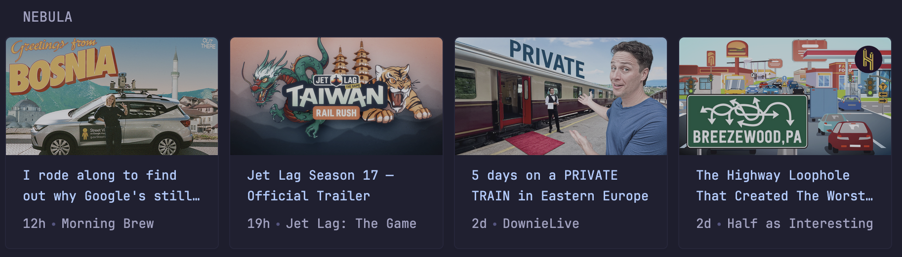
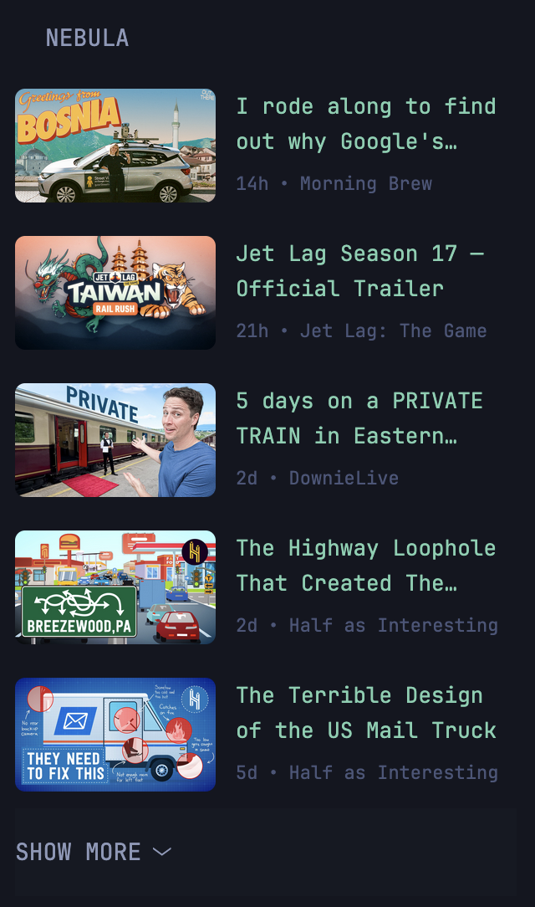

# glance-nebula-widget

Glance widget to display the latest Nebula videos from selected creators/channels.

## Carousel Style



```yaml
- type: custom-api
  title: Nebula
  title-url: https://nebula.tv/
  cache: 15m
  frameless: true
  url: https://content.api.nebula.app/video_episodes/
  parameters:
    ordering: -published_at
    page_size: "100"
  options:
    max_items: 12
    channel-ids:
      - video_channel:9cea6296-223e-4c7e-a245-d96db75de32f # Jet Lag: The Game
      - video_channel:8f3a2a56-3f9f-4ce0-b105-ede41688d84b # Half as Interesting
      - video_channel:fe4d9c1c-017b-494c-9afc-e79e6859b211 # Wendover Productions
  template: |
    {{ if ne .Response.StatusCode 200 }}
      <div class="widget-content-frame padding-widget color-negative">Failed to fetch Nebula videos.</div>
    {{ else }}
      {{ $channels := .Options.JSON "channel-ids" }}
      {{ $maxItems := (index .Options "max_items") }}
      {{ if not $maxItems }}{{ $maxItems = 12 }}{{ end }}
      {{ $shown := 0 }}
      <div class="carousel-container">
        <div class="cards-horizontal carousel-items-container">
          {{ range $video := .JSON.Array "results" }}
            {{ if and (lt $shown $maxItems) (ne "" (findMatch (concat "(^|[^A-Za-z0-9:_-])" ($video.String "channel_id") "([^A-Za-z0-9:_-]|$)") $channels)) }}
              <div class="card widget-content-frame thumbnail-parent">
                {{ if $video.Exists "images.thumbnail.src" }}
                  
                {{ else }}
                  <svg class="video-thumbnail" xmlns="http://www.w3.org/2000/svg" fill="none" viewBox="0 0 24 24" stroke-width="1.5" stroke="var(--color-text-subdue)">
                    <path stroke-linecap="round" stroke-linejoin="round" d="m2.25 15.75 5.159-5.159a2.25 2.25 0 0 1 3.182 0l5.159 5.159m-1.5-1.5 1.409-1.409a2.25 2.25 0 0 1 3.182 0l2.909 2.909m-18 3.75h16.5a1.5 1.5 0 0 0 1.5-1.5V6a1.5 1.5 0 0 0-1.5-1.5H3.75A1.5 1.5 0 0 0 2.25 6v12a1.5 1.5 0 0 0 1.5 1.5Zm10.5-11.25h.008v.008h-.008V8.25Z" />
                  </svg>
                {{ end }}
                <div class="margin-top-10 margin-bottom-widget flex flex-column grow padding-inline-widget">
                  <a class="text-truncate-2-lines margin-bottom-auto color-primary-if-not-visited" href="{{ $video.String "share_url" }}" target="_blank" rel="noreferrer">{{ $video.String "title" }}</a>
                  <ul class="list-horizontal-text flex-nowrap margin-top-7">
                    <li class="shrink-0" {{ $video.String "published_at" | parseTime "rfc3339" | toRelativeTime }}></li>
                    <li class="min-width-0">
                      <a class="block text-truncate" href="{{ concat "https://nebula.tv/" ($video.String "channel_slug") }}" target="_blank" rel="noreferrer">{{ $video.String "channel_title" }}</a>
                    </li>
                  </ul>
                </div>
              </div>
              {{ $shown = add $shown 1 }}
            {{ end }}
          {{ end }}
        </div>
      </div>
    {{ end }}
```

Full file: `nebula-widget-carousel.yml`

## List Style



```yaml
- type: custom-api
  title: Nebula
  title-url: https://nebula.tv/
  cache: 15m
  frameless: true
  url: https://content.api.nebula.app/video_episodes/
  parameters:
    ordering: -published_at
    page_size: "100"
  options:
    max_items: 12
    collapse_after: 5
    channel-ids:
        - video_channel:9cea6296-223e-4c7e-a245-d96db75de32f # Jet Lag: The Game
        - video_channel:8f3a2a56-3f9f-4ce0-b105-ede41688d84b # Half as Interesting
        - video_channel:fe4d9c1c-017b-494c-9afc-e79e6859b211 # Wendover Productions
  template: |
    {{ if ne .Response.StatusCode 200 }}
      <div class="widget-content-frame padding-widget color-negative">Failed to fetch Nebula videos.</div>
    {{ else }}
      {{ $channels := .Options.JSON "channel-ids" }}
      {{ $maxItems := (index .Options "max_items") }}
      {{ $collapseAfter := (index .Options "collapse_after") }}
      {{ if not $maxItems }}{{ $maxItems = 12 }}{{ end }}
      {{ if not $collapseAfter }}{{ $collapseAfter = 5 }}{{ end }}
      {{ $shown := 0 }}

      <ul class="list list-gap-10 collapsible-container" data-collapse-after="{{ $collapseAfter }}" style="list-style: none; padding: 0; margin: 0;">
        {{ range $video := .JSON.Array "results" }}
          {{ if and (lt $shown $maxItems) (ne "" (findMatch (concat "(^|[^A-Za-z0-9:_-])" ($video.String "channel_id") "([^A-Za-z0-9:_-]|$)") $channels)) }}
            <a href="{{ $video.String "share_url" }}" target="_blank" rel="noreferrer" style="text-decoration: none;">
              <li style="padding: 10px 0; border-bottom: 1px solid var(--border-color);">
                <div style="display: flex; gap: 12px; align-items: flex-start;">
                  <div style="flex-shrink: 0; width: 120px; height: 68px; border-radius: 6px; overflow: hidden;">
                    {{ if $video.Exists "images.thumbnail.src" }}
                      
                    {{ else }}
                      <svg xmlns="http://www.w3.org/2000/svg" fill="none" viewBox="0 0 24 24" stroke-width="1.5" stroke="var(--color-text-subdue)" style="width: 100%; height: 100%; padding: 16px;">
                        <path stroke-linecap="round" stroke-linejoin="round" d="m2.25 15.75 5.159-5.159a2.25 2.25 0 0 1 3.182 0l5.159 5.159m-1.5-1.5 1.409-1.409a2.25 2.25 0 0 1 3.182 0l2.909 2.909m-18 3.75h16.5a1.5 1.5 0 0 0 1.5-1.5V6a1.5 1.5 0 0 0-1.5-1.5H3.75A1.5 1.5 0 0 0 2.25 6v12a1.5 1.5 0 0 0 1.5 1.5Zm10.5-11.25h.008v.008h-.008V8.25Z" />
                      </svg>
                    {{ end }}
                  </div>
                  <div style="flex: 1; min-width: 0; display: flex; flex-direction: column; gap: 6px;">
                    <div class="text-truncate-2-lines color-primary">{{ $video.String "title" }}</div>
                    <div class="size-h6 color-subdue" style="display: flex; gap: 6px; align-items: center;">
                      <span>{{ $video.String "published_at" | parseTime "rfc3339" | toRelativeTime }}</span>
                      <span>•</span>
                      <span class="text-truncate">{{ $video.String "channel_title" }}</span>
                    </div>
                  </div>
                </div>
              </li>
            </a>
            {{ $shown = add $shown 1 }}
          {{ end }}
        {{ end }}
      </ul>
    {{ end }}
```

Full file: `nebula-widget-list.yml`

### Configuring

- `max_items`: maximum number of videos to render (default: `12`)
- `collapse_after`: list-only collapse threshold (default: `5`)
- `channel-ids`: only include videos from these channel IDs

